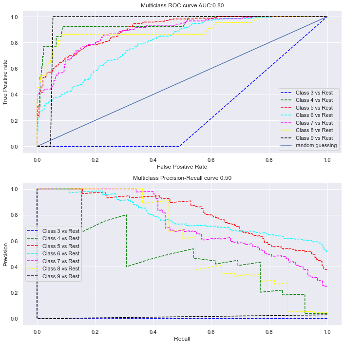
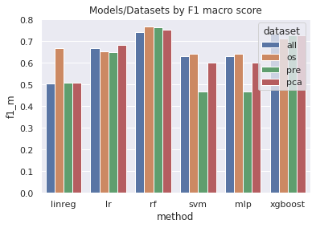
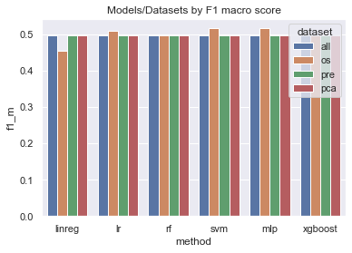

# Predict wine quality

We analyze Wine Quality Dataset [1].
The main challenges:
- multicollinearity of predictors,
- non obvious linearity between predictors and target,
- imbalanced multiclass. 

## Get ready
1. Create a new conda environement
2. Download dependencies:
```bash
pip install -r requirements.txt
```
3. Install ``nb_conda`` to use your conda env in jupyter notebook.
## Usage

Use jupyter notebooks. We have used a separate python script for grid search for computation speed. 
We have prepared functions for ease of evaluation in the notebooks ( evaluate.py and functional.py).

## Results
### 01 - multiclass
Predict wine quality with **white wines** as it is (from quality 3 to quality 9), as continous or categorical target.
**Best classifier**:
- Random Forest
- XGBoost
with all features.

 <br>
_ROC and PR curves for multiclass_

### 02 - binary_07
Predict wine quality as binary target. We use the threshold t=7 to binarize the wine quality.
**Best classifier**:
- Random forest
- XGBoost
used with SMOTE resampling technique.

 <br>
_Macro f1 score result for different models and datasets_

#### 03 - binary_08
Predict wine quality as binary target. We use the threshold t=8 to binarize the wine quality.
**Best classifier**:
- SVM
- MLP
used with SMOTE resampling technique.


 <br>
_Macro f1 score result for different models and datasets_


# References
(P. Cortez, A. Cerdeira, F. Almeida, T. Matos and J. Reis. 
Modeling wine preferences by data mining from physicochemical properties.
In Decision Support Systems, Elsevier, 47(4):547-553. ISSN: 0167-9236. ([pdf](http://www3.dsi.uminho.pt/pcortez/winequality09.pdf))
